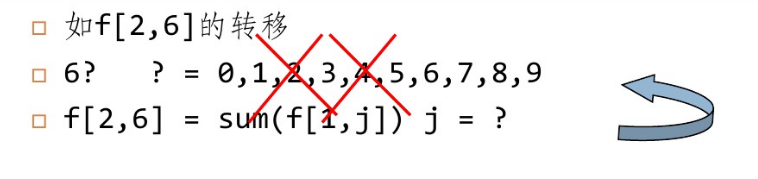
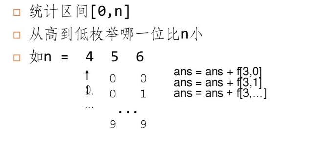
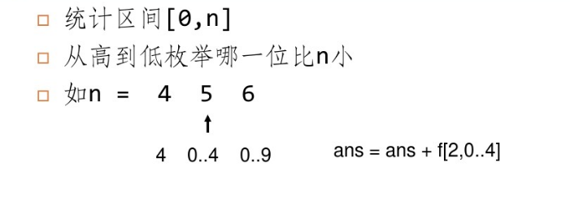

### 基本思想方法

* 统计区间[l,r]的满足题意的数的个数,往往可以转换成求[0,r]-[0,l)
* 对于求区间[0,n)有一个通用的方法
* 对于小于n的数,肯定是从高位到低位出现某一位  小于n 的哪一位。
  * 如n=58  n为十进制数
    * x=49   此时x的十位<n
    * x=51   此时x的个位<n

有了这些性质,就可以从高到低枚举第一次 <n对应位是哪几位。这样之前的位确定了,之后的位就不受n的限制即从00...0~99...9,可以先预处理，然后这时就可以直接统计答案。


* 预处理F数组
* F[i,st]代表   位数为i(可能允许前导0,如00058也是个5位数),状态为st的方案数。
* 如i=4,F[i,st]也就是0000~9999的符合条件的数的个数
* 决策第i位是多少(such as 0~9)
* F[i,st]=F[i,st]+F[i-1,st']  


#### HDU 2089

**题目**:给定区间[n,m],求在n到m中没有"62"或"4"的数的个数。

如62315包含62,89914包含4,皆不合法

0<n<=m<1000000

#### Solution

* 预处理F数组,然后统计[0,m]-[0,n)
* f[i,j]代表开头是j的i位数中不含"62"或"4"的数有几个。
* 如f[2,6]包含60,61,63,65,66,67,68,69

```cpp
f[0,0]=1;
for i=1~7
  for j=0~9  //枚举第i位
    for k=0~9  //枚举第i-1位
      if j<>4 and not(j=6 and k=2)
        f[i,j]=f[i-1,k]+f[i,j]
```









```cpp
//digit[i] 代表n从右到左第i位是多少,len是n有几位
//如n=58  digit[1]=8   digit[2]=5
for i=len~1  //枚举哪一位<n的对应位
  for j=0~digit[i]-1
    if j<>4 and not (j=2  and digit[i+1]=6)
      ans=ans+f[i,j]
  //当i<len时就是在枚举以5开头的
  if digit[i]=4 or (digit[i]=2 and digit[i+1]=6)
      break;  //已经出现4或62
```


#### HDU 3652

**题目:**求小于n是13的倍数且含有'13'的数的个数。

***Solution:* ** 

* 先预处理,在统计
* 题目需要包含13,且被13整除,设计状态f[i,j,k,l]代表
* i位数中第一位是j的
* 是否有包含13(k==1 or 0)
* 模13余数是 l 的数有几个。

```cpp
//决策第i位
for x=0~9
  if k=1  //要求包含13
    f[i,j,k,l]=f[i-1,x,1,(l-j*10^(i-1))%13];
	if j=1 and x=3 //已经有13了
      f[i,j,k,l]=f[i,j,k,l]+f[i-1,x,0,(l-j*10^(i-1))%13];
else //不要求包含13
  if not (j=1 and x=3)
    f[i,j,k,l]=f[i-1,x,0,(l-j*10^(i-1))%13];
```

统计小于n的合法数有几个与上一题类似,只需要记录当前位之前的余数是多少,和是否已经出现了13

```cpp
bit[0]=1
for(ll i=1 ;i<=12;++i )
  bit[i]=bit[i-1]*10;
for(ll i=digit[0],mod=0;i;--i)
  for(ll j=0;j<digit[i];++j){
    ans+=f[i][j][1][(13-mod*bit[i]%13)%13];
    if(t || (j==3 && digit[i+1]==1 ))
      ans+=f[i][j][0][(13-mod*bit[i]%13)%13];
  }
  if(digit[i+1]==1 && digit[i]==3) t=1;
  mod=(mod*10+digit[i])%13;
}
```