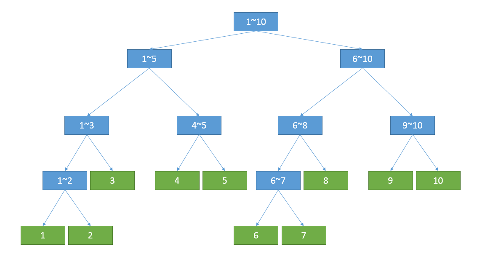
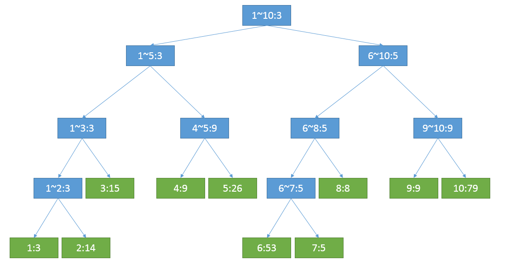
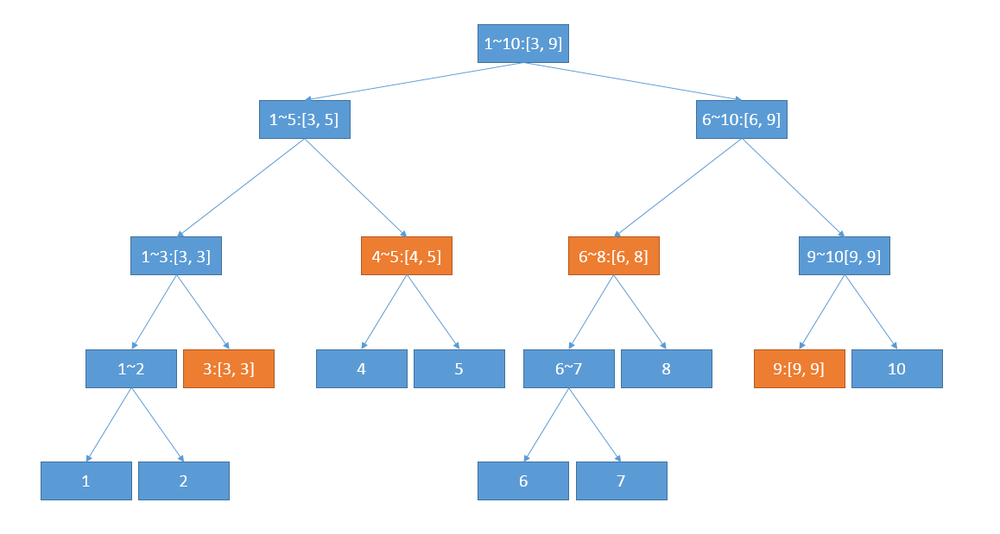
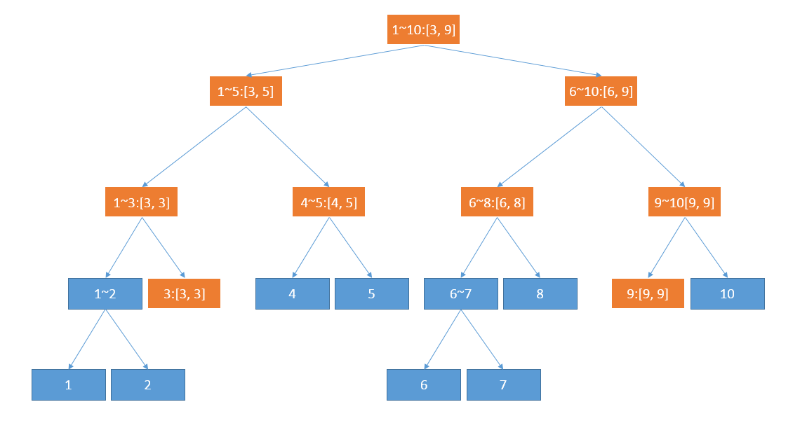
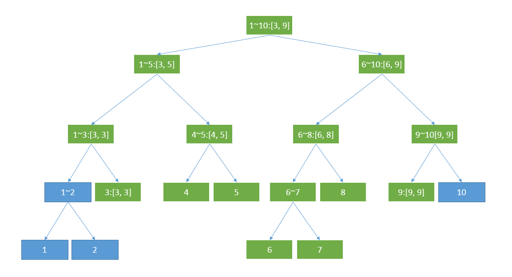
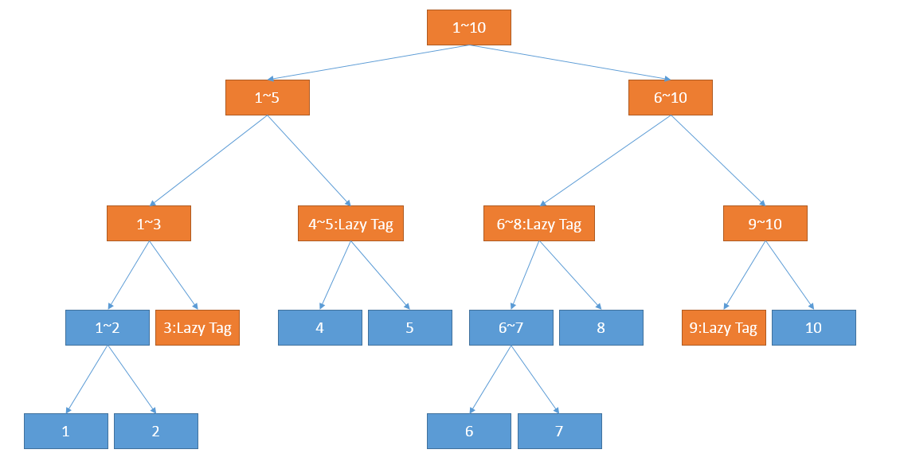

线段树本质就是用一棵树来维护一段区间上和某个子区间相关的值——例如区间和、区间最大最小值一类的。

具体做法：树的根节点表示了整段区间,根节点的左儿子节点表示了这段区间的前半部分,根节点的右儿子表示了这段区间的后半部分——并以此类推,对于这棵树的每个节点,如果这个节点所表示的区间长度大于1,则令其左儿子节点表示这段区间的前半部分,令其右儿子表示这段区间的后半部分。

以一段长度为10的区间为例,建立的线段树应该是这个样子的：

N=10

weight={3,14,15,9,26,53,5,8,9,79}

**一个节点所对应的区间中的最小值便是它的两个儿子节点所对应的区间中的最小值中更小的那一个**

这样只需要O(N)的时间复杂度就可以计算出这棵树来

修改：当某个位置的商品的重量发生改变的时候,对应的,就是这棵树的某个叶子结点的值发生了变化——但是和ST算法不同,包含这个节点的区间,便只有这个节点的所有祖先节点,而这样的节点数量事实上是很少的——只有O(log(N))级别,也就是说,当一次修改操作发生的时候,只需要改变数量在O(log(N))级别的节点的值就可以完成操作了,修改的时间复杂度是O(log(N)).

查询：从线段树的根开始,对于当前访问的线段树节点t,设其对应的区间为[A,B]，如果询问的区间[l,r]完全处于前半段或者后半段——即r<=(A+B)/2或 l>(A+B)/2,那么递归进入t对应的子节点进行处理(因为另一棵子树中显然不会有任何区间需要用到)。否则的话,则把询问区间分成2部分[l,(A+B)/2] 和 [(A+B)/2+1,r]，并且分别进入t的左右子树处理这两段查询区间(因为2棵子树中显然都有区间需要用到)，当然了,如果[A,B]正好覆盖了[l,r]的话,就可以直接返回之间计算的t这棵子树中的最小值了。加入要询问[3,9]这段区间了,结果是——橙色部分标注的区间。

首先[3,9]分解成了[3,5]和[6,9]两个区间，而[3,5]分解成了[3,3]和[4,5]——均没有必要继续分解,[6,9]分解成了[6,8]和[9,9]——同样也没有必要继续分解了,每一步的分解都是必要的,所以这已经是最好的分解方法了。

首先根据初始数据,使用O(N)的时间构建一棵最原始的线段树,这个过程使用子节点的值计算父亲节点的值,从而避免冗余计算。然后对于每一次操作,如果是一次修改的话,就将修改的节点和这个节点的所有祖先节点的值都进行更新,可以用O(logN)的时间复杂度完成,而如果是一次询问的话,会使用上面描述的方法来对询问区间进行分解,这样虽然不像ST算法那样是O(1),但是却实现了平衡,无论是修改还是查询的时间复杂度都是O(log(N))的,所以算法的最终复杂度是O(N+Q*log(N)).

**错误思路**：像询问一样,将修改的区间分解成若干个小区间,只修改这些区间和它们的祖先节点的值,这样区间只会有O(log(N))个,那么修改的时间复杂度也在这个量级。

**错误原因:**第一次修改的是[3,9]这个区间话,那么就会把它拆成[3,3],[4,5],[6,8],[9,9]4个区间,那么得到修改的只有橙色的这些区间,但是如果我之后查询了[6,7]这个区间的话,仍然会按照修改之间的价格进行计算。

理论上说,修改[3,9]这个区间,所有绿色的节点的值都要得到重新计算的:

但是实际上没有必要这么做——可以引入一种叫做Lazy Tag,即懒惰标记的东西——的确对于[3,9]这样一次修改操作,只去修改橙色的节点,但是在这个基础上,要在[3,9]分解出的4个区间[3,3],[4,5],[6,8],[9,9]所对应的节点上做一个懒惰标记,表示"之前有一次操作需要将这棵子树中的所有节点的价格都进行修改,但是因为还没有用到这棵子树中的值所以暂时不去修改"。

懒惰标记就是一个暂时不去处理,等到需要用到的时候在进行处理的思想。

比如询问了[6,7]这个区间,那么再从上往下分解的时候,会发现[6,8]这个区间有一个懒惰标记,那么就应该进行一次懒惰标记的下放操作——也就是说去修改[6,8]这个节点的左右儿子的值,并且同时给左右儿子添加新的懒惰标记,然后将[6,8]的懒惰标记去掉。

也就是说——本来[6,8]的左右儿子早在之前的修改操作中就需要一同进行修改的,但是因为还没有用到单独的[6,7],[8,8]之类的区间的原因,所以可以暂时不处理这些节点的修改,而是用一个懒惰标记记录下来这些节点需要进行修改这件事情。然后再之后要用到这些值的时候再进行这些操作。

