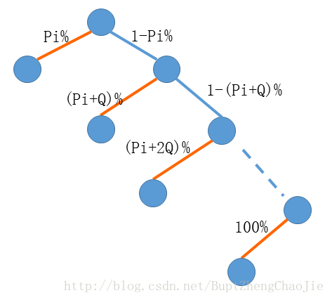

## 思路


通过观察,可以发现红圈中的子树和黄圈中的子树一模一样,这提示我们,无论第一件物品是如何获得的(完成第一件任务就获得还是完成两件任务后获得),第二件传说物品都是从25%概率开始,与第一件无关。因为每得到一个传奇后,概率是变成 $\frac{P}{2^i}$,这里i是当前传奇的数量,也就是说,如果这次以P的概率得到传奇了,那么下次得到传奇的概率会是

P/2,如果下次不能得到传奇(1-P/2),那么下下次得到传奇的概率是P/2+Q：



换句话说,每件传说物品的获得都是独立的,如果X和Y是两个独立的随机变量,那么E(X+Y)=E(X)+E(Y),于是,可以分别求得第一件、第二件...第N件传说物品的期望任务数,再把他们加起来就是最终答案。


因为概率不断增加Q%,最多完成100个任务就一定能获得第i件传说物品,所以计算第i件传说物品的期望任务数的复杂度是O(100),这样计算N件传说物品的总复杂度就是O(100N)的。


进一步分析,会发现虽然计算了N棵二叉树对应的期望任务数,但这N棵二叉树总共最多有101种形态,因为Q不变,Pi的值决定了这棵二叉树长什么样子,而P一共有0~100共101种取值,所以只需预先求出起始概率分别是100%、98%...0%时的期望数,保存在数组f[]里，计算第i件传说物品时,根据Pi直接把相应的f[Pi]累加即可。

可以使用倒推的方法求出f[],而不用每次O(100)重新计算：

```c
f[100]=1；
for(int i=99;i>=0;i--){
	//如果这次的任务没获得,下一个任务获得的概率
	int j=min(i+Q,100);
	// i%的概率1次获得,(1-i%)的概率是从j%起始的期望任务数+1
	f[i]=i% *1 + (1-i%) *(f[j]+1);
	
}
```

于是得到一个O(100+N)的算法,比之前的O(100N)好了100倍。


再进一步分析,发现 
$$
\lfloor \frac{P}{2^l} \rfloor 
$$
会很快下降到0,实际上从第8件传说物品开始,起始概率就一定是0了,也就是说从第8件开始可以直接用f[0]*(N-7)算出期望任务数的和,这样得到了一个更快的O(100+8)的算法


